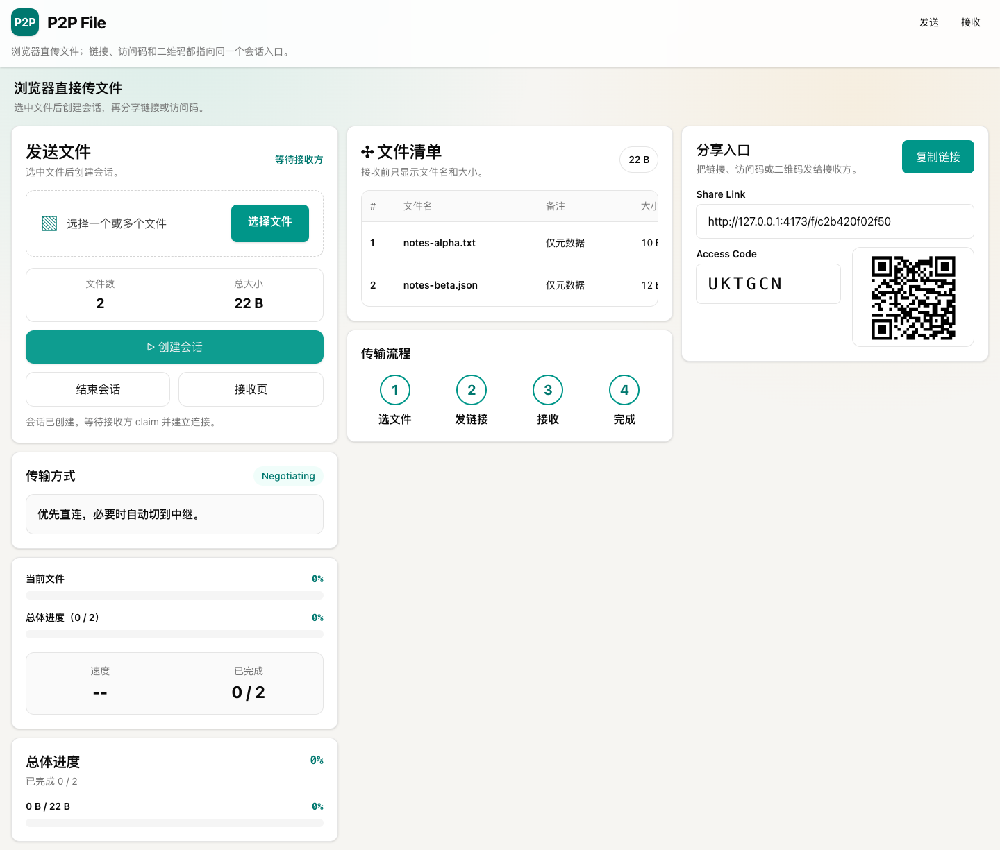
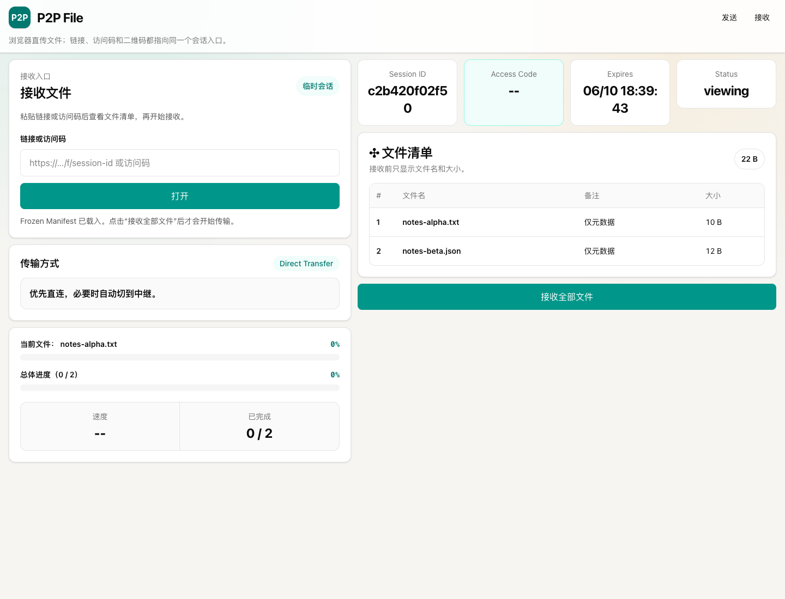

# P2P File

Browser-first file transfer for sending files directly between two browsers. P2P File creates a short-lived session with a Share Link, Access Code, and QR Code that all point to the same transfer window. File contents stay on the peer path by default and only use relay transport when connectivity requires it.

## Screenshots

### Sender console



### Receiver preview



## What it does

- Sender selects one or more files and creates a Temporary Session Window.
- Receiver opens the Share Link, Access Code, or QR Code and sees a metadata-only Frozen Manifest before claiming.
- One receiver can claim a session at a time; later visitors see an occupied or completed notice.
- Transfers prefer Direct Transfer over WebRTC DataChannel and disclose Relayed Transfer when fallback is used.
- Multi-file transfers are serial. Completed files can be retained on receiver retry; unfinished files restart at file boundaries.
- Completed sessions enter a short-lived read-only Completed Session View for the sender and original receiver.

## Scope boundaries

This v1 intentionally does not provide folder transfer, partial receive, sender reattach after refresh, PWA/desktop/CLI surfaces, durable transfer history, upload-to-cloud fallback, or an extra application-layer passphrase.

## Repository layout

```text
apps/web        React 19 + Vite sender/receiver app
apps/signal     Hono-on-Bun signaling API and WebSocket service
packages/shared Zod schemas, protocol types, shared constants
tests/e2e       Playwright browser E2E coverage
scripts         repo guard scripts for naming, size, and dependency boundaries
```

## Stack

- Runtime/package manager/test runner: Bun 1.x
- Frontend: React 19, TypeScript, Vite, React Router v7, Tailwind CSS 4
- Signaling: Hono on Bun with WebSocket support
- State: in-memory session store by default, Redis-backed session store when `REDIS_URL` is set
- Transfer: WebRTC DataChannel with STUN/TURN configuration and WebSocket relay fallback
- Validation: Zod, Bun test, Playwright, Biome

## Getting started

```bash
just setup
just dev
```

Local services:

- Web app: `http://127.0.0.1:4173`
- Signal status: `http://127.0.0.1:3001/api/status`

If `just` is not installed, use the equivalent Bun scripts from `package.json`.

## Configuration

Build-time and runtime variables:

```bash
REDIS_URL=redis://127.0.0.1:6379
VITE_SIGNAL_ORIGIN=https://signal.example.com
VITE_TURN_URL=turn:turn.example.com:3478
VITE_TURN_USERNAME=example-user
VITE_TURN_CREDENTIAL=example-password
```

Without `REDIS_URL`, the signal service uses the in-memory live session store for local development and tests.

## Deployment conditions

Current deployment needs two services:

- **Web**: serves the built Vite SPA and must provide history fallback for `/`, `/receive`, and `/f/:sessionId`.
- **Signal**: serves HTTP session APIs and the WebSocket signaling endpoint on `/ws/:sessionId/:role/:token`.

Recommended production conditions:

- Public HTTPS for the web origin.
- Public HTTPS/WSS for the signal origin.
- WebSocket upgrade support on the signal reverse proxy.
- **Redis** via `REDIS_URL` when running more than one signal instance. Without Redis, session state stays in-memory and is only safe for a single signal container/process.
- **TURN** credentials when transfers must work across restrictive NAT/firewall environments. The web build reads `VITE_TURN_URL`, `VITE_TURN_USERNAME`, and `VITE_TURN_CREDENTIAL`.
- Set `VITE_SIGNAL_ORIGIN` at web build time when the web and signal services are on different origins.

## Docker

This repository ships a multi-target root `Dockerfile`.

Build the web image:

```bash
docker build \
  --target web \
  --build-arg VITE_SIGNAL_ORIGIN=https://signal.example.com \
  --build-arg VITE_TURN_URL=turn:turn.example.com:3478 \
  --build-arg VITE_TURN_USERNAME=example-user \
  --build-arg VITE_TURN_CREDENTIAL=example-password \
  -t p2pfile-web .
```

Build the signal image:

```bash
docker build --target signal -t p2pfile-signal .
```

Run the signal container:

```bash
docker run --rm -p 3001:3001 \
  -e REDIS_URL=redis://redis:6379 \
  p2pfile-signal
```

Run the web container:

```bash
docker run --rm -p 8080:80 p2pfile-web
```

## Validation commands

Use the root `justfile` as the canonical command surface:

```bash
just lint       # naming, file length, dependency boundaries, Biome
just typecheck  # shared, signal, and web TypeScript validation
just test-unit  # Bun unit/integration tests
just test-e2e   # Playwright browser E2E tests
just build      # workspace builds
just check      # lint + typecheck + tests + build
```

Current E2E coverage includes Share Link entry, Access Code entry, QR Code entry, direct transfer, relay fallback disclosure, retry-budget exhaustion, interrupted receiver resume, occupied sessions, sender-ended sessions, storage failure handling, and mobile no-horizontal-overflow checks.

## Security and privacy notes

- Share Links are bearer credentials.
- Share surfaces are marked non-indexable and previews stay generic.
- Frozen Manifest exposes metadata only before claim; no file thumbnails or content preview are shown.
- The signaling service coordinates sessions and signals; file contents are not uploaded to application storage.

## Documentation

- Domain language and invariants: [`CONTEXT.md`](CONTEXT.md)
- Runtime/product rules: [`docs/mvp-product-rules.md`](docs/mvp-product-rules.md)
- Feature scope and acceptance criteria: [`docs/feature-spec/p2p-file-first-version-feature-spec.md`](docs/feature-spec/p2p-file-first-version-feature-spec.md)
